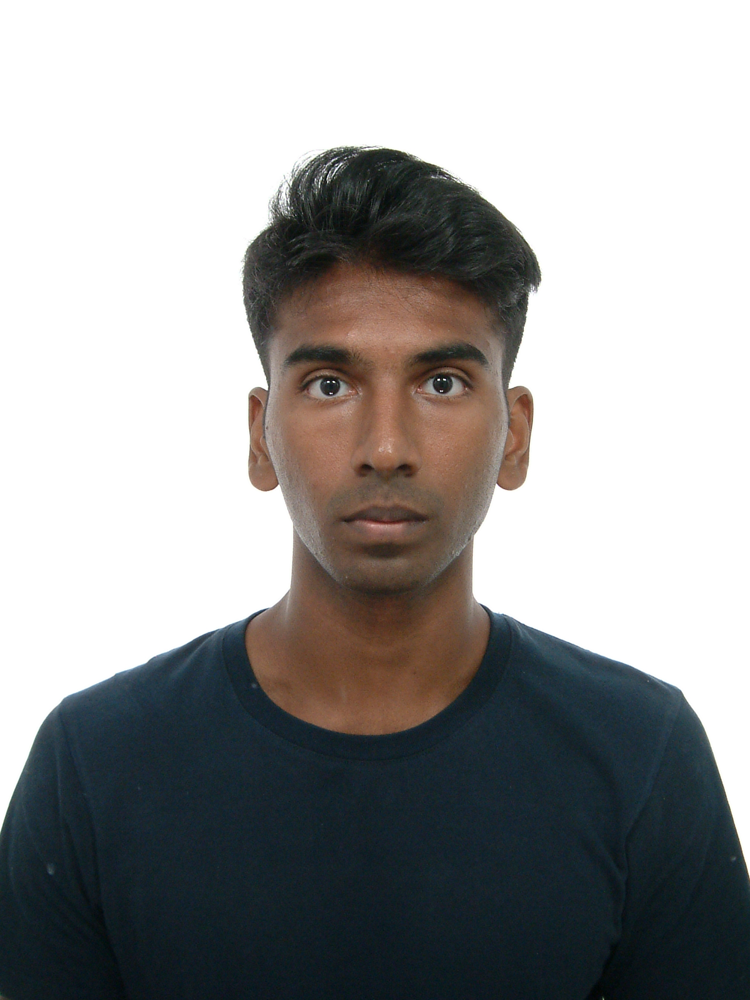

We are a team based in the [School of Computing, National University of Singapore](https://www.comp.nus.edu.sg).

You can reach us at the email `e1406437@u.nus.edu`

## Project team

### Aaron Toh

[[github](https://github.com/aarontoh)]

* Role: Code Quality

### Kwong Wai Kin

[[github](http://github.com/makis4n)]

* Role: Team Lead
* Responsibilities: UI

### Thejus Unnikrishnan

[[github](http://github.com/thejus03)] 

* Role: Developer
* Responsibilities: Data

### Rishi

[[github](http://github.com/Rihiz)]

* Role: Developer
* Responsibilities: Dev Ops + Threading

### Naresh Nehru

[[github](http://github.com/naresh2478)]

* Role: Testing
* Responsibilities: Ensures the testing of the project is done properly and on time.
