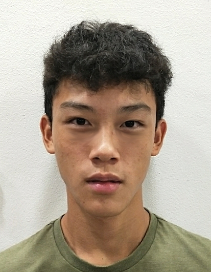
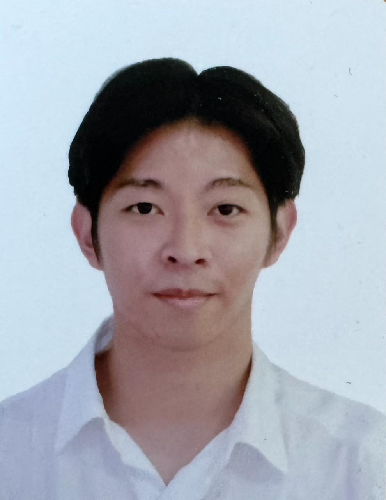
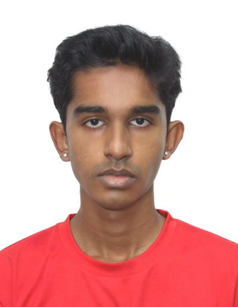

We are a team based in the [School of Computing, National University of Singapore](https://www.comp.nus.edu.sg).

You can reach us at the email `seer[at]comp.nus.edu.sg`

## Project team

### Aaron Toh

[[homepage](http://www.comp.nus.edu.sg/~damithch)]
[[github](https://github.com/aarontoh)]
[[portfolio](team/johndoe.md)]

* Role: Code Quality

### Kwong Wai Kin

[[github](http://github.com/makis4n)]
[[portfolio](team/johndoe.md)]

* Role: Team Lead
* Responsibilities: UI

### Thejus Unnikrishnan

[[github](http://github.com/thejus03)] [[portfolio](team/johndoe.md)]

* Role: Developer
* Responsibilities: Data

### Jean Doe

[[github](http://github.com/johndoe)]
[[portfolio](team/johndoe.md)]

* Role: Developer
* Responsibilities: Dev Ops + Threading

### James Doe

[[github](http://github.com/johndoe)]
[[portfolio](team/johndoe.md)]

* Role: Developer
* Responsibilities: UI
