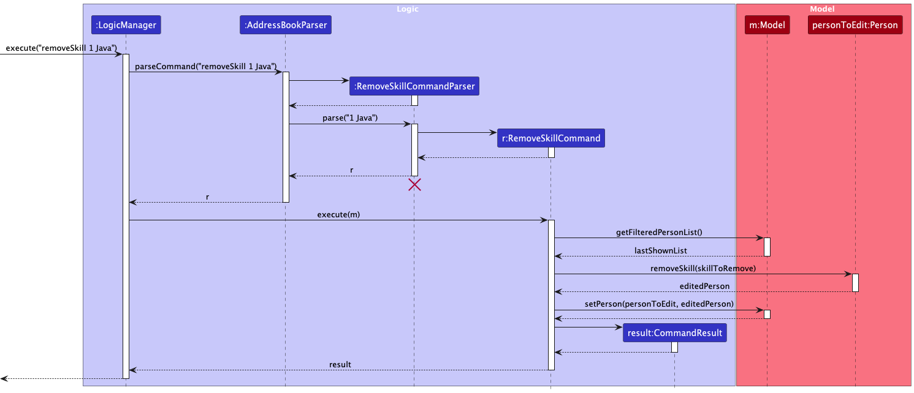

* Table of Contents
{:toc}

--------------------------------------------------------------------------------------------------------------------

## **Acknowledgements**

* {list here sources of all reused/adapted ideas, code, documentation, and third-party libraries -- include links to the original source as well}

--------------------------------------------------------------------------------------------------------------------

## **Setting up, getting started**

Refer to the guide [_Setting up and getting started_](SettingUp.md).

--------------------------------------------------------------------------------------------------------------------

## **Design**

<div markdown="span" class="alert alert-primary">

:bulb: **Tip:** The `.puml` files used to create diagrams are in this document `docs/diagrams` folder. Refer to the [_PlantUML Tutorial_ at se-edu/guides](https://se-education.org/guides/tutorials/plantUml.html) to learn how to create and edit diagrams.
</div>

### Architecture


The ***Architecture Diagram*** given above explains the high-level design of the App.

Given below is a quick overview of main components and how they interact with each other.

**Main components of the architecture**

**`Main`** (consisting of classes [`Main`](https://github.com/se-edu/addressbook-level3/tree/master/src/main/java/seedu/address/Main.java) and [`MainApp`](https://github.com/se-edu/addressbook-level3/tree/master/src/main/java/seedu/address/MainApp.java)) is in charge of the app launch and shut down.
* At app launch, it initializes the other components in the correct sequence, and connects them up with each other.
* At shut down, it shuts down the other components and invokes cleanup methods where necessary.

The bulk of the app's work is done by the following four components:

* [**`UI`**](#ui-component): The UI of the App.
* [**`Logic`**](#logic-component): The command executor.
* [**`Model`**](#model-component): Holds the data of the App in memory.
* [**`Storage`**](#storage-component): Reads data from, and writes data to, the hard disk.

[**`Commons`**](#common-classes) represents a collection of classes used by multiple other components.

**How the architecture components interact with each other**

The *Sequence Diagram* below shows how the components interact with each other for the scenario where the user issues the command `delete 1`.


Each of the four main components (also shown in the diagram above),

* defines its *API* in an `interface` with the same name as the Component.
* implements its functionality using a concrete `{Component Name}Manager` class (which follows the corresponding API `interface` mentioned in the previous point.

For example, the `Logic` component defines its API in the `Logic.java` interface and implements its functionality using the `LogicManager.java` class which follows the `Logic` interface. Other components interact with a given component through its interface rather than the concrete class (reason: to prevent outside component's being coupled to the implementation of a component), as illustrated in the (partial) class diagram below.


The sections below give more details of each component.

### UI component

The **API** of this component is specified in [`Ui.java`](https://github.com/se-edu/addressbook-level3/tree/master/src/main/java/seedu/address/ui/Ui.java)


The UI consists of a `MainWindow` that is made up of parts e.g.`CommandBox`, `ResultDisplay`, `PersonListPanel`, `TeamListPanel`, `StatusBarFooter` etc. All these, including the `MainWindow`, inherit from the abstract `UiPart` class which captures the commonalities between classes that represent parts of the visible GUI.

The `UI` component uses the JavaFx UI framework. The layout of these UI parts are defined in matching `.fxml` files that are in the `src/main/resources/view` folder. For example, the layout of the [`MainWindow`](https://github.com/se-edu/addressbook-level3/tree/master/src/main/java/seedu/address/ui/MainWindow.java) is specified in [`MainWindow.fxml`](https://github.com/se-edu/addressbook-level3/tree/master/src/main/resources/view/MainWindow.fxml)

The `UI` component,

* executes user commands using the `Logic` component.
* listens for changes to `Model` data so that the UI can be updated with the modified data.
* keeps a reference to the `Logic` component, because the `UI` relies on the `Logic` to execute commands.
* depends on some classes in the `Model` component, as it displays `Person` object and Team object residing in the `Model`.

### Logic component

**API** : [`Logic.java`](https://github.com/se-edu/addressbook-level3/tree/master/src/main/java/seedu/address/logic/Logic.java)

Here's a (partial) class diagram of the `Logic` component:


The sequence diagram below illustrates the interactions within the `Logic` component, taking `execute("delete 1")` API call as an example.


<div markdown="span" class="alert alert-info">:information_source: **Note:** The lifeline for `DeleteCommandParser` should end at the destroy marker (X) but due to a limitation of PlantUML, the lifeline continues till the end of diagram.
</div>

How the `Logic` component works:

1. When `Logic` is called upon to execute a command, it is passed to an `AddressBookParser` object which in turn creates a parser that matches the command (e.g., `DeleteCommandParser`) and uses it to parse the command.
1. This results in a `Command` object (more precisely, an object of one of its subclasses e.g., `DeleteCommand`) which is executed by the `LogicManager`.
1. The command can communicate with the `Model` when it is executed (e.g. to delete a person).<br>
   Note that although this is shown as a single step in the diagram above (for simplicity), in the code it can take several interactions (between the command object and the `Model`) to achieve.
1. The result of the command execution is encapsulated as a `CommandResult` object which is returned back from `Logic`.

Here are the other classes in `Logic` (omitted from the class diagram above) that are used for parsing a user command:


How the parsing works:
* When called upon to parse a user command, the `AddressBookParser` class creates an `XYZCommandParser` (`XYZ` is a placeholder for the specific command name e.g., `AddCommandParser`) which uses the other classes shown above to parse the user command and create a `XYZCommand` object (e.g., `AddCommand`) which the `AddressBookParser` returns back as a `Command` object.
* All `XYZCommandParser` classes (e.g., `AddCommandParser`, `DeleteCommandParser`, ...) inherit from the `Parser` interface so that they can be treated similarly where possible e.g, during testing.

### Model component
**API** : [`Model.java`](https://github.com/se-edu/addressbook-level3/tree/master/src/main/java/seedu/address/model/Model.java)


The `Model` component,

* stores the address book data i.e., all `Person` objects (which are contained in a `UniquePersonList` object) and all `Team` objects (which are contained in a `UniqueTeamList` object) in an `AddressBook` object.
* stores the currently 'selected' `Person` objects (e.g., results of a search query) as a separate _filtered_ list which is exposed to outsiders as an unmodifiable `ObservableList<Person>` that can be 'observed' e.g. the UI can be bound to this list so that the UI automatically updates when the data in the list change.
* stores a `UserPref` object that represents the user’s preferences. This is exposed to the outside as a `ReadOnlyUserPref` objects.
* does not depend on any of the other three components (as the `Model` represents data entities of the domain, they should make sense on their own without depending on other components)

<div markdown="span" class="alert alert-info">:information_source: **Note:** An alternative (arguably, a more OOP) model is given below. It has a `Tag` list in the `AddressBook`, which `Person` references. This allows `AddressBook` to only require one `Tag` object per unique tag, instead of each `Person` needing their own `Tag` objects.<br>


</div>


### Storage component

**API** : [`Storage.java`](https://github.com/se-edu/addressbook-level3/tree/master/src/main/java/seedu/address/storage/Storage.java)


The `Storage` component,
* can save both address book data and user preference data in JSON format, and read them back into corresponding objects.
* inherits from both `AddressBookStorage` and `UserPrefStorage`, which means it can be treated as either one (if only the functionality of only one is needed).
* depends on some classes in the `Model` component (because the `Storage` component's job is to save/retrieve objects that belong to the `Model`)

### Common classes

Classes used by multiple components are in the `seedu.address.commons` package.

--------------------------------------------------------------------------------------------------------------------

## **Implementation**

This section describes some noteworthy details on how certain features are implemented.

### Create Team feature

#### Implementation

The Create Team feature allows users to form teams by selecting multiple persons from the address book and associating them with a hackathon. This feature is implemented through the `CreateTeamCommand` class and its associated parser `CreateTeamCommandParser`.

**Key Components:**

* `CreateTeamCommand` — Creates a team with a team name, hackathon name, and a set of team members.
* `CreateTeamCommandParser` — Parses user input to extract team name, hackathon name, and person indices.
* `Team` — Represents a team entity with a name, associated hackathon, and set of members.
* `TeamName` — Value object representing a valid team name.
* `HackathonName` — Value object representing a valid hackathon name.

**Command Format:**
```
createTeam tn/TEAM_NAME h/HACKATHON_NAME p/INDEX [p/INDEX]...
```

**How the Create Team feature works:**

1. The user enters a `createTeam` command with the team name, hackathon name, and indices of persons to add as members.
2. `AddressBookParser` recognizes the `createTeam` command word and delegates parsing to `CreateTeamCommandParser`.
3. `CreateTeamCommandParser` extracts the team name, hackathon name, and person indices from the input.
4. A `CreateTeamCommand` object is created with the parsed information.
5. When executed, `CreateTeamCommand` performs the following:
    * Validates all person indices against the current filtered person list
    * Checks if the team already exists in the model
    * Retrieves the `Person` objects corresponding to each valid index
    * Ensures that none of the selected persons are already part of a team for the specified hackathon
    * Creates a new `Team` object with the specified name, hackathon, and members
    * Adds the team to the model
6. A `CommandResult` is returned with a success message containing the team details.

**Sequence of Operations:**


Given below is an example usage scenario:

Step 1. The user has a list of persons displayed and wants to create a team for "Hackathon 2024" with persons at indices 1 and 3.

Step 2. The user executes `createTeam tn/Development Team h/Hackathon 2024 p/1 p/3`.

Step 3. The command is parsed and `CreateTeamCommand` is executed with the following validations:
* Check that indices 1 and 3 are within bounds of the filtered person list
* Check if a team with the name "Development Team" for "Hackathon 2024" already exists
* Retrieve the persons at these indices
* Ensure neither person is already in a team for "Hackathon 2024"
* Create a `Team` object with name "Development Team", hackathon "Hackathon 2024", and the two selected persons

Step 4. The team is added to the model's team list.

Step 6. A success message is displayed showing the created team details.

**Error Handling:**

The `CreateTeamCommand` handles several error cases:

* **Missing parameters** — If required prefixes (team name, hackathon name, or at least one person index) are missing, the parser throws a `ParseException` with usage instructions
* **Invalid person index** — If any provided index is out of bounds, a `CommandException` is thrown 
* **Duplicate team** — If a team with the same name and hackathon already exists, a `CommandException` is thrown 
* **Person already in team** — If any selected person is already part of a team for the specified hackathon, a `CommandException` is thrown 

#### Design considerations:

**Aspect: How to identify team members:**

* **Alternative 1 (current choice):** Use person indices from the currently displayed list.
    * Pros: Simple and consistent with other commands (e.g., `delete`, `edit`). Users can filter the list first, then create teams from visible persons.
    * Cons: Indices change when the list is filtered, which may confuse users if they don't realize the list has been filtered.

* **Alternative 2:** Use unique identifiers (e.g., email or GitHub username).
    * Pros: More stable—identifiers don't change based on display order. Less error-prone when the list is filtered.
    * Cons: More verbose for users to type. Requires users to remember or look up exact identifiers.

**Aspect: Team uniqueness:**

* **Alternative 1 (current choice):** Teams are unique by team name and hackathon name combination.
    * Pros: Allows multiple teams with the same name across different hackathons. Reflects real-world usage where team names might be reused.
    * Cons: More complex uniqueness check.

* **Alternative 2:** Teams are unique by team name only.
    * Pros: Simpler implementation and uniqueness check.
    * Cons: Prevents reusing team names across different hackathons, which is restrictive.

### List Teams feature

#### Implementation

The List Teams feature allows users to view all teams created in the address book. This feature is implemented through the `ListTeamsCommand` class.

Step 1. The user enters a `listTeams` command.
Step 2. `AddressBookParser` recognizes the `listTeams` command word and creates a `ListTeamsCommand` object.
Step 3. When executed, `ListTeamsCommand` performs the following:
* Retrieves the list of all teams from the model.
* Updates the filtered team list in the model to show all teams.
Step 4. A `CommandResult` is returned with a message indicating that all teams are being listed.

The following sequence diagram illustrates the interactions within the system when a user executes a list teams command:


### Remove Skill feature

#### Implementation

The Remove Skill feature allows users to remove a specific skill from a person's profile. This is useful when a person's skill set changes or when a skill was added by mistake. The feature is implemented through the `RemoveSkillCommand` class and its associated parser `RemoveSkillCommandParser`.

**Key Components:**

* `RemoveSkillCommand` — Removes a specified skill from a person at a given index.
* `RemoveSkillCommandParser` — Parses user input to extract the person's index and the skill name to be removed.

**Command Format:**
```
removeSkill INDEX SKILL_NAME
```

**How the Remove Skill feature works:**

The sequence diagram below illustrates the interactions within the system when a user executes a remove skill command:



1. The user enters a `removeSkill` command with the person's index and the skill name to remove.
2. `AddressBookParser` recognizes the `removeSkill` command word and delegates parsing to `RemoveSkillCommandParser`.
3. `RemoveSkillCommandParser` extracts the index and skill name from the input.
4. A `RemoveSkillCommand` object is created with the parsed information.
5. When executed, `RemoveSkillCommand` performs the following:
    * Validates the person index against the current filtered person list.
    * Retrieves the person at the specified index.
    * Checks if the person has the specified skill.
    * Creates a new `Person` object with the skill removed.
    * Updates the person in the model.
6. A `CommandResult` is returned with a success message.

**Parser Integration:**
- The command word `removeSkill` is recognized in `AddressBookParser`.
- Arguments are parsed by `RemoveSkillCommandParser`, which expects an index and a skill name separated by a space.

**Error Handling:**
- If the index is invalid, an error message is shown.
- If the skill does not exist for the person, an error message is shown.

### \[Proposed\] Undo/redo feature

#### Proposed Implementation

The proposed undo/redo mechanism is facilitated by `VersionedAddressBook`. It extends `AddressBook` with an undo/redo history, stored internally as an `addressBookStateList` and `currentStatePointer`. Additionally, it implements the following operations:

* `VersionedAddressBook#commit()` — Saves the current address book state in its history.
* `VersionedAddressBook#undo()` — Restores the previous address book state from its history.
* `VersionedAddressBook#redo()` — Restores a previously undone address book state from its history.

These operations are exposed in the `Model` interface as `Model#commitAddressBook()`, `Model#undoAddressBook()` and `Model#redoAddressBook()` respectively.

Given below is an example usage scenario and how the undo/redo mechanism behaves at each step.

Step 1. The user launches the application for the first time. The `VersionedAddressBook` will be initialized with the initial address book state, and the `currentStatePointer` pointing to that single address book state.


Step 2. The user executes `delete 5` command to delete the 5th person in the address book. The `delete` command calls `Model#commitAddressBook()`, causing the modified state of the address book after the `delete 5` command executes to be saved in the `addressBookStateList`, and the `currentStatePointer` is shifted to the newly inserted address book state.


Step 3. The user executes `add n/David …​` to add a new person. The `add` command also calls `Model#commitAddressBook()`, causing another modified address book state to be saved into the `addressBookStateList`.


<div markdown="span" class="alert alert-info">:information_source: **Note:** If a command fails its execution, it will not call `Model#commitAddressBook()`, so the address book state will not be saved into the `addressBookStateList`.

</div>

Step 4. The user now decides that adding the person was a mistake, and decides to undo that action by executing the `undo` command. The `undo` command will call `Model#undoAddressBook()`, which will shift the `currentStatePointer` once to the left, pointing it to the previous address book state, and restores the address book to that state.


<div markdown="span" class="alert alert-info">:information_source: **Note:** If the `currentStatePointer` is at index 0, pointing to the initial AddressBook state, then there are no previous AddressBook states to restore. The `undo` command uses `Model#canUndoAddressBook()` to check if this is the case. If so, it will return an error to the user rather
than attempting to perform the undo.

</div>

The following sequence diagram shows how an undo operation goes through the `Logic` component:


<div markdown="span" class="alert alert-info">:information_source: **Note:** The lifeline for `UndoCommand` should end at the destroy marker (X) but due to a limitation of PlantUML, the lifeline reaches the end of diagram.

</div>

Similarly, how an undo operation goes through the `Model` component is shown below:


The `redo` command does the opposite — it calls `Model#redoAddressBook()`, which shifts the `currentStatePointer` once to the right, pointing to the previously undone state, and restores the address book to that state.

<div markdown="span" class="alert alert-info">:information_source: **Note:** If the `currentStatePointer` is at index `addressBookStateList.size() - 1`, pointing to the latest address book state, then there are no undone AddressBook states to restore. The `redo` command uses `Model#canRedoAddressBook()` to check if this is the case. If so, it will return an error to the user rather than attempting to perform the redo.

</div>

Step 5. The user then decides to execute the command `list`. Commands that do not modify the address book, such as `list`, will usually not call `Model#commitAddressBook()`, `Model#undoAddressBook()` or `Model#redoAddressBook()`. Thus, the `addressBookStateList` remains unchanged.


Step 6. The user executes `clear`, which calls `Model#commitAddressBook()`. Since the `currentStatePointer` is not pointing at the end of the `addressBookStateList`, all address book states after the `currentStatePointer` will be purged. Reason: It no longer makes sense to redo the `add n/David …​` command. This is the behavior that most modern desktop applications follow.


The following activity diagram summarizes what happens when a user executes a new command:


#### Design considerations:

**Aspect: How undo & redo executes:**

* **Alternative 1 (current choice):** Saves the entire address book.
  * Pros: Easy to implement.
  * Cons: May have performance issues in terms of memory usage.

* **Alternative 2:** Individual command knows how to undo/redo by
  itself.
  * Pros: Will use less memory (e.g. for `delete`, just save the person being deleted).
  * Cons: We must ensure that the implementation of each individual command are correct.

_{more aspects and alternatives to be added}_

### \[Proposed\] Data archiving

_{Explain here how the data archiving feature will be implemented}_


--------------------------------------------------------------------------------------------------------------------

## **Documentation, logging, testing, configuration, dev-ops**

* [Documentation guide](Documentation.md)
* [Testing guide](Testing.md)
* [Logging guide](Logging.md)
* [Configuration guide](Configuration.md)
* [DevOps guide](DevOps.md)

--------------------------------------------------------------------------------------------------------------------

## **Appendix: Requirements**

### Product scope

**Target user profile**:

* tech-savvy undergraduate computer science students who actively participate in university hackathons
* comfortable with GitHub and command-line tools
* prefer typing over graphical interfaces

**Value proposition**: Mate helps students quickly find the right hackathon teammates by surfacing peers based on skills and proficiency. With a simple CLI-first interface and color-coded skill tags, students can instantly discover, connect, and form balanced teams without wasting time on endless networking


### User stories

Priorities: High (must have) - `* * *`, Medium (nice to have) - `* *`, Low (unlikely to have) - `*`

| Priority | As a …​ | I want to …​                                                          | So that I can…​                                          |
|------|---------|-----------------------------------------------------------------------|----------------------------------------------------------|
| `* * *` | student | search for peers by programming language                              | quickly find potential teammates with matching skills.   |
| `* * *` | student | create a team from selected contacts                               | form balanced teams for hackathons                       |
| `* * *` | student | edit members of an existing team                                        | adjust team composition as needed                        |
| `* * *` | student | view color-coded skill tags                                           | quickly assess a person's proficiency level              |
| `* * *` | student | search for multiple skills at once                                    | find students with overlapping technical expertise       |
| `* * *` | student | add my own skills to my profile                                       | let others discover me for team formation                |
| `* *` | student | save profiles as facorites                                            |  easily revisit promising teammates later                  |
| `* *` | student | search by GitHub username                                             | I can review their past projects before contacting them. |
| `* *` | student | search for people by email                                            | directly connect with someone I already know             |
| `*`  | student | import contacts from CSV                                             | quickly build my network without manual entry            |
| `*`  | student | export a team to CSV                                                 | easily share team details with teammates                 |

### Use cases

(For all use cases below, the **System** is `Mate` and the **Actor** is the `user`, unless specified otherwise)


**Use case: Delete a person**

**MSS**

1.  User requests to list persons
2.  Mate shows a list of persons
3.  User requests to delete a specific person in the list
4.  Mate deletes the person

    Use case ends.

**Extensions**

* 2a. The list is empty.

  Use case ends.

* 3a. The given index is invalid.

    * 3a1. Mate shows an error message.

      Use case resumes at step 2.

**Use case: Remove a person from a hackathon team**

1.  User requests to list teams
2.  Mate shows a list of teams
3.  User requests to remove a specific person from a specific team
4.  Mate removes the person from the team and indicates that the person is interested in joining a team for the hackathon

    Use case ends.

**Extensions**

* 2a. The list is empty.

  Use case ends.

* 3a. The given team or person is invalid.

    * 3a1. Mate shows an error message.

      Use case resumes at step 2.

* 3b. The person is not part of the team.

    * 3b1. Mate shows an error message.

      Use case resumes at step 2.

* 4a. The user wants to indicate that the person is not interested in joining a team for the hackathon.

    * 4a1. User requests to indicate that the person is not interested in joining a team for the hackathon.
    * 4a2. Mate confirms the indication.

      Use case ends.

**Use case: Import Contacts from CSV**

**MSS**

1.  Student requests to import contacts.
2.  Mate requests the file path.
3.  Student enters the file path.
4.  Mate validates the CSV format and parses entries.
5.  Mate imports and displays the number of successful entries.

    Use case ends.

**Extensions**

* 3a. File not found or inaccessible.
    * 3a1. Mate highlights the error and requests a valid file path.
    * 3a2. Student re-enters the file path.

      Use case resumes at step 3.

* 4b. CSV contains invalid or missing fields.
    * 4b1. Mate highlights errors and requests a corrected file.
    * 4b2. Student fixes and re-uploads.

      Use case resumes at step 4.

* 5a. Duplicate contacts detected.
    * 5a1. Mate asks whether to merge or skip duplicates.
    * 5a2. Student chooses.

      Use case ends.

### Non-Functional Requirements

1.  Should work on any _mainstream OS_ as long as it has Java `17` or above installed.
2.  Should be able to hold up to 1000 persons without a noticeable sluggishness in performance for typical usage.
3.  A user with above average typing speed for regular English text (i.e. not code, not system admin commands) should be able to accomplish most of the tasks faster using commands than using the mouse.
4.  Data should be stored locally in a human-editable file (JSON) so that advanced users can directly edit or back up the data.
5.  Data file must not exceed 10 MB in size under normal use (≈ 1000 contacts with details).
6.  Should provide useful error messages when invalid commands are entered, without crashing the system.
7.  Should start up within 3 seconds on a standard laptop.
8.  Should not require an internet connection for normal usage (offline-first).
9.  The system should be portable (able to run as a standalone JAR without additional dependencies beyond Java).
10. Source code should be maintainable by future developers with minimal onboarding, following clean code conventions and including developer documentation.

### Glossary

* **Mainstream OS**: Windows, Linux, Unix, MacOS
* **Offline-first**: A design principle where the system does not require an internet connection for normal usage; all features work locally.
* **Private contact detail**: A contact detail that is not meant to be shared with others

--------------------------------------------------------------------------------------------------------------------

## **Appendix: Instructions for manual testing**

Given below are instructions to test the app manually.

<div markdown="span" class="alert alert-info">:information_source: **Note:** These instructions only provide a starting point for testers to work on;
testers are expected to do more *exploratory* testing.

</div>

### Launch and shutdown

1. Initial launch

   1. Download the jar file and copy into an empty folder

   2. Double-click the jar file Expected: Shows the GUI with a set of sample contacts. The window size may not be optimum.

2. Saving window preferences

   1. Resize the window to an optimum size. Move the window to a different location. Close the window.

   2. Re-launch the app by double-clicking the jar file.<br>
      Expected: The most recent window size and location is retained.

### Deleting a person

1. Deleting a person while all persons are being shown

   1. Prerequisites: List all persons using the `list` command. Multiple persons in the list.

   2. Test case: `delete 1`<br>
      Expected: First contact is deleted from the list. Details of the deleted contact shown in the status message. Timestamp in the status bar is updated.

   3. Test case: `delete 0`<br>
      Expected: No person is deleted. Error details shown in the status message. Status bar remains the same.

   4. Other incorrect delete commands to try: `delete`, `delete x`, `...` (where x is larger than the list size)<br>
      Expected: Similar to previous.

2. Deleting a person after a find command

    1. Prerequisites: `find java`
    
    2. Test case: `delete 1`<br>
       Expected: First person in the filtered list is deleted from the address book. Details of the deleted contact shown in the status message. Timestamp in the status bar is updated.
    
    3. Test case: `delete 0`<br>
       Expected: No person is deleted. Error details shown in the status message. Status bar remains the same.
    
    4. Other incorrect delete commands to try: `delete`, `delete x`, `...` (where x is larger than the filtered list size)<br>
       Expected: Similar to previous.

### Creating a team

1. Creating a team from selected persons in the list

   1. Test case: `createTeam tn/Alpha Team hn/Hackathon 2024 p/1 p/2`<br>
      Expected: Team "Alpha Team" for "Hackathon 2024" is created with persons at index 1 and 2 as members. Details of the created team shown in the status message. Timestamp in the status bar is updated.

   2. Test case: `createTeam tn/Beta Team hn/Hackathon 2024 p/0 p/x` (where x is larger than the list size) <br>
      Expected: No team is created. Error details shown in the status message. Status bar remains the same.

2. Creating a team with duplicate name

   1. Prerequisites: Create a team named "Alpha Team" for "Hackathon 2024" with persons at index 1 and 2 as members.

   2. Test case: `createTeam tn/Alpha Team hn/Hackathon 2024 p/3 p/4`<br>
      Expected: No team is created. Error details shown in the status message indicating that the team already exists. Status bar remains the same.

   3. Test case: `createTeam tn/Alpha Team hn/Hackathon 2025 p/3 p/4`<br>
      Expected: Team "Alpha Team" for "Hackathon 2025" is created with persons at index 3 and 4 as members. Same team name different hackathon allowed. Details of the created team shown in the status message. Timestamp in the status bar is updated.

3. Creating a team for a hackathon with person already participating in hackathon

   1. Prerequisites: Create a team named "Alpha Team" for "Hackathon 2024" with persons at index 1 and 2 as members.

   2. Test case: `createTeam tn/Gamma Team hn/Hackathon 2024 p/2 p/3`<br>
      Expected: No team is created. Error details shown in the status message indicating that person at index 2 is already participating in "Hackathon 2024". Status bar remains the same.

### Removing a person from a team

1. Removing a person from a team

   1. Prerequisites: Create a team named "Alpha Team" for "Hackathon 2024" with persons at index 1 and 2 as members.

   2. Test case: `removeFromTeam tn/Alpha Team p/1`<br>
      Expected: Person at index 1 is removed from team "Alpha Team". Details of the updated team shown in the status message. Timestamp in the status bar is updated.

   3. Test case : `removeFromTeam tn/Alpha Team p/3`<br>
      Expected: No person is removed. Error details shown in the status message indicating that person at index 3 is not a member of team "Alpha Team". Status bar remains the same.

--------------------------------------------------------------------------------------------------------------------

## **Appendix: Effort**

- While AB3 primarily deals with the person object in the model component, Mate extends this functionality by introducing a team object. The team object encapsulates a collection of person objects, allowing users to group individuals based on shared skills and hackathon participation. This extension required significant modifications to the model component to accommodate team management features, including creating, listing, and modifying teams.
- Additionally, several of the new commands introduced like `addToTeam` and `removeFromTeam` required careful handling of the relationships between persons and teams, as there was a bidirectional association that needed to be maintained.
- Other commands like `createTeam` also required deliberation on what should be allowed, such as preventing duplicate team names for the same hackathon and ensuring that a person cannot be added to multiple teams for the same hackathon.

