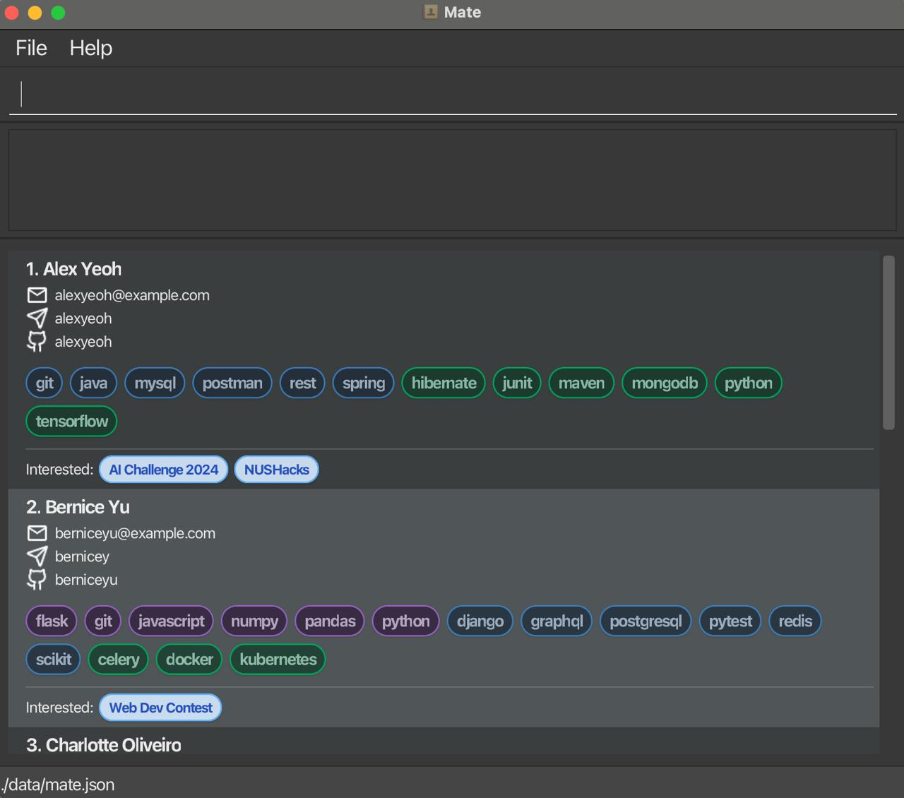
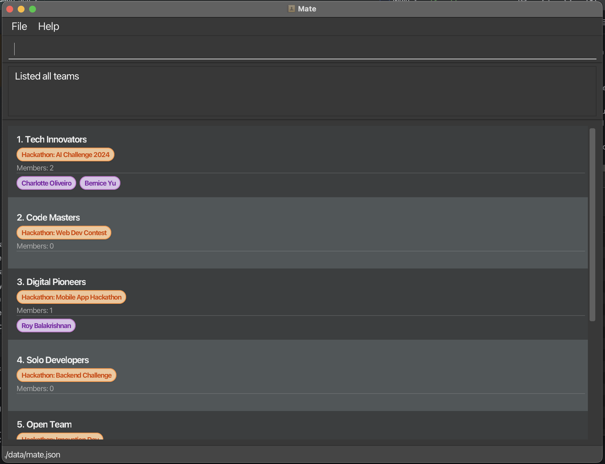

Mate is a desktop app that helps users quickly find the right hackathon teammates by surfacing peers based on skills and proficiency. With a simple CLI-first interface and color-coded skill tags, users can instantly discover, connect, and form balanced teams without wasting time on endless networking.

Mate is designed for hackathon participants across the technical spectrum — from developers, designers, and data scientists to product managers, domain experts, and non-technical contributors (e.g. UX, marketing, business). It serves students and professionals who value fast, pragmatic workflows.

* Table of Contents
{:toc}

## Quick start
1. Ensure you have Java `17` or above installed in your Computer. 
   **Mac users:** Ensure you have the precise JDK version prescribed [here](https://se-education.org/guides/tutorials/javaInstallationMac.html).

2. Download the latest `.jar` file from [here](https://github.com/AY2526S1-CS2103T-F08b-2/tp/releases).

3. Copy the file to the folder you want to use as the _home folder_ for Mate.

4. Open a command terminal, `cd` into the folder you put the jar file in, and use the `java -jar mate.jar` command to run the application. A GUI similar to the below should appear in a few seconds. Note how the app contains some sample data.

5. Type the command in the command box and press Enter to execute it. e.g. typing **`help`** and pressing Enter will open the help window. 
   Some example commands you can try:

   * `list` : Lists all persons.

   * `listTeam` : Lists all teams.

   * `add n/John Doe e/johnd@example.com t/JohnTG g/JohnGH` : Adds a contact named `John Doe` to Mate.

   * `delete p/3` : Deletes the 3rd contact shown in the current list.

   * `createTeam tn/Development Team h/Hackathon 2024 p/1 p/2` : Creates a team with the first two contacts as members.

   * `exit` : Exits the app.

6. Refer to the [Features](#features) below for details of each command.

--------------------------------------------------------------------------------------------------------------------

## Features

**:information_source: Notes about the command format:** 

* Words in `UPPER_CASE` are the parameters to be supplied by the user. 
  e.g. in `add n/NAME`, `NAME` is a parameter which can be used as `add n/John Doe`.

* Items in square brackets are optional. 
  e.g. `n/NAME [h/HACKATHON]` can be used as `n/John Doe h/NUSHacks` or as `n/John Doe`.

* Items with `…`​ after them can be used multiple times including zero times. 
  e.g. `[h/HACKATHON]…​` can be used as `​` (i.e. 0 times), `h/NUSHacks`, `h/NUSHacks h/NTUHacks` etc.

* Parameters can be in any order. 
  e.g. if the command specifies `n/NAME t/TELEGRAM`, `t/TELEGRAM  n/NAME` is also acceptable.

* Extraneous parameters for commands that do not take in parameters (such as `help`, `list`, `listTeam`, `exit` and `clear`) will be ignored. 
  e.g. if the command specifies `help 123`, it will be interpreted as `help`.

* If you are using a PDF version of this document, be careful when copying and pasting commands that span multiple lines as space characters surrounding line-breaks may be omitted when copied over to the application.

* Commands are case-insensitive. e.g. `ADD n/John` is equivalent to `add n/John`

### Field constraints

This table summarises the input restrictions for each field in Mate:
* All fields cannot be empty.
* Fields with leading or trailing spaces will have the spaces trimmed automatically.
* Fields are case-insensitive unless otherwise specified.

| Field         | Prefix | Constraints                                                                                                                                                                                                                                                                                                                             | Valid Examples                                                   | Invalid Examples                                 |
|---------------|--------|-----------------------------------------------------------------------------------------------------------------------------------------------------------------------------------------------------------------------------------------------------------------------------------------------------------------------------------------|------------------------------------------------------------------|--------------------------------------------------|
| **Name**      | `n/`   | • Only alphabetical characters, spaces and `/` • Must be unique                                                                                                                                                                                                                                                                    | • `John Doe` • `Vaikesh s/o Manimaran`                        | • `@John` • `Bob123` • `Amy_Wu`            |
| **Email**     | `e/`   | • Format: `local-part@domain` • Local part: alphanumeric and `+_.-` only • Local part and domain cannot start/end with special characters • Domain: alphanumeric with hyphens allowed • Domain must end with at least 2 characters • Special characters must be between alphanumerical characters • Must be unique | • `john@example.com` • `user+tag@uni.edu.sg`                   | • `john-+.@ex.com` • `user@.com`              |
| **Telegram**  | `t/`   | • 5–32 characters long • Only letters, numbers, and underscores • Cannot start with `@` • Cannot start or end with underscore • Cannot have consecutive underscores • Must be unique                                                                                                                                   | • `john_doe` • `alice123`                                     | • `_john` • `john_` • `jo__hn` • `@john` |
| **GitHub**    | `g/`   | • 1–39 characters long • Only letters, numbers, and hyphens • Cannot start or end with hyphen • Cannot have consecutive hyphens • No underscores, spaces, or symbols • Must be unique                                                                                                                                  | • `john-doe` • `alice123`                                     | • `-john` • `john-` • `jo--hn` •`john_doe` |
| **Skill**     | `sk/`  | • Only alphanumeric characters • May include `+`, `#`, `.`, `-`, or `_` symbols • Cannot start with `#` • At least 1 character long • Optional level: `Beginner`, `Intermediate`, or `Advanced` (case-insensitive)                                                                                                          | • `java` • `c++` • `.net` • `c#` • `python:Advanced` | • `#sharp` • `java:`                          |
| **Hackathon** | `h/`   | • Only alphanumeric characters and spaces                                                                                                                                                                                                                                                                                               | • `NUSHacks` • `AI Challenge 2024`                            | •`NUS_Hacks` •`@Event`                        |
| **Team Name** | `tn/`  | • Only alphanumeric characters and spaces • Must be unique                                                                                                                                                                                                                                                                           | • `Development Team` • `Alpha Squad`                          | • `Team_A` •`@TeamName`                       |
| **Index**     | `p/`   | • Must be a positive integer • Must be valid in the current displayed list                                                                                                                                                                                                                                                       | • `1` • `5` • `100`                                        | • `0` • `-1` • `1.5` • `abc`            |
| **Keyword**   | `k/`   | • Can contain any characters including spaces                                                                                                                                                                                                                                                                                           | • `John` • `c++` • `AI Hackathon 2024`                     | _(No restrictions)_                              |

### Viewing help : `help`

Shows a message explaining how to access the help page.

Format: `help`

### Listing all persons : `list`

Shows a list of all persons in Mate.

Format: `list`

### Clearing all entries : `clear`

Clears all entries from Mate.

Format: `clear`

:exclamation: **Warning:**
This action is irreversible! All persons and teams will be permanently deleted. Make sure to back up your data file before clearing if you might need it later.

### Exiting the program : `exit`

Exits the program.

Format: `exit`

### Adding a person: `add`

Adds a person to Mate.

Format: `add n/NAME e/EMAIL t/TELEGRAM_NAME g/GITHUB_NAME [sk/SKILL[:LEVEL]]…​ [h/HACKATHON]…​`

* Skills are displayed with color-coded backgrounds: **Beginner** (Green), **Intermediate** (Blue), **Advanced** (Purple).
* Skills are sorted by level (Advanced → Intermediate → Beginner), then alphabetically.
* `HACKATHON` entries are added to the person's interested hackathons.
* Duplicate skills or hackathons are not allowed.
* See [Field Constraints](#field-constraints) for input requirements.

Examples:
* `add n/John Doe e/johnd@example.com t/JohnTG g/JohnGH`
* `add n/Alice e/alice@example.com t/alice_tg g/alice123 sk/docker h/TechChallenge`
* `add n/Betsy Crowe e/betsycrowe@example.com t/Betsygram g/Betsy03 sk/c#:Intermediate sk/java:Advanced h/NUSHack h/iNTUition`

### Locating persons : `find`

Finds persons who match **all** the given keywords.

Format: `find k/KEYWORD [k/MORE_KEYWORDS]…​`

* Searches across name, email, Telegram, GitHub, skills, and hackathons.
* Returns persons matching **all** keywords (AND search).
* Partial matching is supported (e.g. `NUS` matches `NUSHack` and `NUS TechJam`).
* See [Field Constraints](#field-constraints) for input requirements.

Examples:
* `find k/John` returns persons with name `john` or `John Doe`, or email `john@example.com`, or Telegram `john123`
* `find k/java k/python` returns persons that have both `java` AND `python` as skills.
* `find k/AI Hackathon 2024` returns persons interested in or participating in hackathons containing `AI Hackathon 2024`

### Deleting a person : `delete`

Deletes the specified person from Mate.

Format: `delete p/INDEX`

* Deletes the person at the specified `INDEX`.
* See [Field Constraints](#field-constraints) for index requirements.

Examples:
* `list` followed by `delete p/2` deletes the 2nd person in the displayed list.
* `find k/Betsy` followed by `delete p/1` deletes the 1st person in the results of the `find` command.

### Editing a person : `edit`

Edits an existing person's contact details in Mate.

Format: `edit p/INDEX [n/NAME] [e/EMAIL] [t/TELEGRAM_NAME] [g/GITHUB_NAME]`

* At least one of the optional fields must be provided.
* Existing values will be updated to the input values.
* See [Field Constraints](#field-constraints) for input requirements.

:bulb: **Tip:**
Use dedicated commands to manage skills (`addSkill`, `removeSkill`) and hackathons (`addHackathon`, `removeHackathon`).

Examples:
* `edit p/2 n/Betsy Crower` edits the name of the 2nd person in the displayed list to `Betsy Crower`.
* `edit p/1 e/johndoe@example.com t/johndoe_tg` edits the email address and Telegram name of the 1st person in the displayed list.

### Adding skills to a person : `addSkill`

Adds one or more skills (with optional levels) to a person.

Format: `addSkill p/INDEX sk/SKILL[:LEVEL] [sk/SKILL[:LEVEL]]...`

* If the skill already exists, it will be upgraded/downgraded to the new level.
* Duplicate skills in the parameters with different levels will cause the command to fail (no partial addition).
* See [Field Constraints](#field-constraints) for input requirements.

Examples:
* `addSkill p/1 sk/java:Advanced` adds Java (Advanced) to the 1st person in the displayed list (or upgrades it if a lower level existed).
* `addSkill p/2 sk/python sk/docker:Intermediate` adds Python (Beginner) and Docker (Intermediate) to the 2nd person in the displayed list.

### Removing a skill from a person : `removeSkill`

Removes one or more skills from a person in Mate.

Format: `removeSkill p/INDEX sk/SKILL [sk/SKILL]...`

* If the person doesn't have any of the specified skills, the command fails (no partial removal).
* See [Field Constraints](#field-constraints) for input requirements.

Examples:
* `removeSkill p/1 sk/python` removes the Python skill from the 1st person in the displayed list.

### Adding an interested hackathon to a person : `addHackathon`

Adds one or more hackathons to a person's interested list.

Format: `addHackathon p/INDEX h/HACKATHON_NAME [h/HACKATHON_NAME]...`

* A hackathon cannot be added to the interested list if the person is already participating in it via a team.
* If a hackathon is already in the interested list, the other hackathons are added (partial addition).
* See [Field Constraints](#field-constraints) for input requirements.

Examples:
* `addHackathon p/1 h/NUSHack` adds NUSHack to the 1st person's interested list.
* `addHackathon p/2 h/NUSHack h/iNTUition` adds both hackathons to the 2nd person's interested list.

### Removing an interested hackathon from a person : `removeHackathon`

Removes one or more hackathons from a person's interested hackathon list.

Format: `removeHackathon p/INDEX h/HACKATHON_NAME [h/HACKATHON_NAME]...`

* Cannot remove a hackathon the person is currently participating in (they must be removed from the team first).
* See [Field Constraints](#field-constraints) for input requirements.

Examples:
* `removeHackathon p/2 h/TechChallenge` removes TechChallenge from person 2's interested list.
* `removeHackathon p/4 h/NUSHack h/iNTUition` removes both hackathons from person 4.

### Listing all teams : `listTeam`

Shows a list of all teams in Mate.

Format: `listTeam`

### Creating a team : `createTeam`

Creates a new team in Mate with the specified team members.

Format: `createTeam tn/TEAM_NAME h/HACKATHON_NAME p/INDEX [p/INDEX]…​`

* A team can be created with zero or more members.
* Team members cannot be in multiple teams for the same hackathon.
* The hackathon is automatically moved from interested to participating hackathons for all members.
* See [Field Constraints](#field-constraints) for input requirements.

:bulb: **Tip:**
Make sure to use the `list` command first to see the current index numbers of persons before creating a team.

:information_source: **Note:** If you provide the same person index multiple times (for example `p/1 p/1 p/1`), Mate will de-duplicate indices when creating a team — the team will contain that single person only. To add multiple different members, pass each member's index once.

Examples:
* `createTeam tn/Alpha Squad h/AI Challenge p/2 p/4 p/5` creates a team called "Alpha Squad" for the "AI Challenge" hackathon with the 2nd, 4th, and 5th persons as members.

### Deleting a team : `deleteTeam`

Deletes a team from Mate and removes all members from that team.

Format: `deleteTeam tn/TEAM_NAME`

* All team members are automatically removed from the team.
* The team's hackathon is removed from all members' participating hackathons (but NOT added back to interested hackathons).
* See [Field Constraints](#field-constraints) for input requirements.

:bulb: **Tip:**
Use the `listTeam` command first to see the team names before deleting one.

Examples:
* `deleteTeam tn/Alpha Squad` deletes the team named "Alpha Squad".

### Adding a person to a team : `addToTeam`

Adds an existing person to an existing team in Mate.

Format: `addToTeam p/INDEX tn/TEAM_NAME`

* The team must already exist.
* A person can be in multiple teams for different hackathons, but not multiple teams for the same hackathon.
* The team's hackathon is automatically moved from interested to participating hackathons for the person.
* See [Field Constraints](#field-constraints) for input requirements.

Examples:
* `addToTeam p/1 tn/Alpha Squad` adds the 1st person to the "Alpha Squad" team.

### Removing a person from a team : `removeFromTeam`

Removes an existing person from an existing team in Mate.

Format: `removeFromTeam p/INDEX tn/TEAM_NAME`

* The team must already exist and the person must be a member.
* The team's hackathon is automatically moved from participating to interested hackathons for the person.
* See [Field Constraints](#field-constraints) for input requirements.

Examples:
* `removeFromTeam p/1 tn/Alpha Squad` removes the 1st person in the displayed list from the "Alpha Squad" team.

### Saving the data

Mate's data is saved in the hard disk automatically after any command that changes the data. There is no need to save manually.

### Editing the data file

Mate's data is saved automatically as a JSON file `[JAR file location]/data/mate.json`. Advanced users are welcome to update data directly by editing that data file.

:exclamation: **Caution:**
If your changes to the data file makes its format invalid, Mate will discard all data and start with an empty data file at the next run. Hence, it is recommended to take a backup of the file before editing it. 
Furthermore, certain edits can cause Mate to behave in unexpected ways (e.g., if a value entered is outside the acceptable range). Therefore, edit the data file only if you are confident that you can update it correctly.

--------------------------------------------------------------------------------------------------------------------

## FAQ

**Q**: How do I transfer my data to another Computer? 
**A**: Install the app in the other computer and overwrite the empty data file it creates with the file that contains the data of your previous Mate home folder.

--------------------------------------------------------------------------------------------------------------------

## Known issues

1. **When using multiple screens**, if you move the application to a secondary screen, and later switch to using only the primary screen, the GUI will open off-screen. The remedy is to delete the `preferences.json` file created by the application before running the application again.
2. **If you minimise the Help Window** and then run the `help` command (or use the `Help` menu, or the keyboard shortcut `F1`) again, the original Help Window will remain minimised, and no new Help Window will appear. The remedy is to manually restore the minimised Help Window.

--------------------------------------------------------------------------------------------------------------------

## Command summary

| Action                      | Format, Examples                                                                                                                                                                      |
|-----------------------------|---------------------------------------------------------------------------------------------------------------------------------------------------------------------------------------|
| **Help**                    | `help`                                                                                                                                                                                |
| **List**                    | `list`                                                                                                                                                                                |
| **Clear**                   | `clear`                                                                                                                                                                               |
| **Exit**                    | `exit`                                                                                                                                                                                |
| **Add Person**              | `add n/NAME e/EMAIL t/TELEGRAM_NAME g/GITHUB_NAME [sk/SKILL[:LEVEL]]…​ [h/HACKATHON]…​`   e.g. `add n/John Doe e/johnd@example.com t/JohnTG g/JohnGH sk/Python:Advanced h/NUSHack` |
| **Find**                    | `find k/KEYWORD [k/MORE_KEYWORDS]…​`  e.g. `find k/Java`                                                                                                                           |
| **Delete Person**           | `delete p/INDEX`  e.g. `delete p/3`                                                                                                                                                |
| **Edit Person**             | `edit p/INDEX [n/NAME] [e/EMAIL] [t/TELEGRAM_NAME] [g/GITHUB_NAME]`  e.g. `edit p/2 n/James Lee`                                                                                   |
| **Add Skill**               | `addSkill p/INDEX sk/SKILL[:LEVEL] [sk/SKILL[:LEVEL]]...`  e.g. `addSkill p/1 sk/java:Advanced`                                                                                    |
| **Remove Skill**            | `removeSkill p/INDEX sk/SKILL [sk/SKILL]...`  e.g. `removeSkill p/1 sk/Java`                                                                                                       |
| **Add Hackathon**           | `addHackathon p/INDEX h/HACKATHON_NAME [h/HACKATHON_NAME]...`  e.g. `addHackathon p/1 h/NUSHack`                                                                                   |
| **Remove Hackathon**        | `removeHackathon p/INDEX h/HACKATHON_NAME [h/HACKATHON_NAME]...`  e.g. `removeHackathon p/1 h/NUSHack`                                                                             |
| **List Team**               | `listTeam`                                                                                                                                                                            |
| **Create Team**             | `createTeam tn/TEAM_NAME h/HACKATHON_NAME p/INDEX [p/INDEX]…​`   e.g. `createTeam tn/Development Team h/Tech Innovation 2024 p/1 p/3`                                              |
| **Delete Team**             | `deleteTeam tn/TEAM_NAME`  e.g. `deleteTeam tn/Development Team`                                                                                                                   |
| **Add Person to Team**      | `addToTeam p/INDEX tn/TEAM_NAME`   e.g. `addToTeam p/3 tn/Development Team`                                                                                                        |
| **Remove Person from Team** | `removeFromTeam p/INDEX tn/TEAM_NAME`   e.g. `removeFromTeam p/3 tn/Development Team`                                                                                              |
