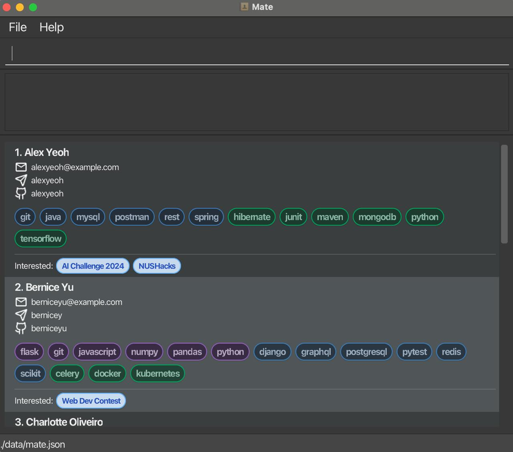

**Mate is a desktop application that makes participating in hackathons easier.** While it has a GUI, most of the user interactions happen using a CLI (Command Line Interface).

* If you are interested in using Mate, head over to the [_Quick Start_ section of the **User Guide**](https://ay2526s1-cs2103t-f08b-2.github.io/tp/UserGuide.html#quick-start).
* If you are interested about developing Mate, the [**Developer Guide**](https://ay2526s1-cs2103t-f08b-2.github.io/tp/DeveloperGuide.html) is a good place to start.

**Acknowledgements**

* Libraries used: [JavaFX](https://openjfx.io/), [Jackson](https://github.com/FasterXML/jackson), [JUnit5](https://github.com/junit-team/junit5)
